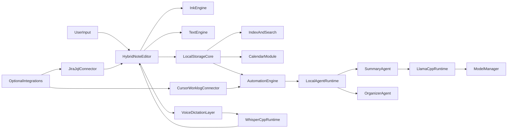

# Groundbreaking Minimal Note App Plan

## Product North Star
- Fast capture first: every action must feel immediate (new note, write, draw, organize).
- Pen-and-paper fidelity: natural freehand behavior, low-friction switching between typing and ink.
- Elegant, sharp aesthetic: retro-cyberpunk influence with restraint (not neon-heavy, not gimmicky).
- AI as an assistant, never a driver: always available locally for organization but never intrusive; no chat-centric UX.

## Research Findings Applied to Your Idea
- Users abandon heavy tools when they feel slow/over-configurable; avoid “workspace bloat” and keep defaults simple.
- Handwriting users consistently reject diagram-first engines for long-form writing due to lag and awkward stylus behavior; v1 must optimize handwriting as a first-class interaction.
- Calendar and automation must be clear and reliable; hidden background complexity should never block note capture.
- Local-first and offline reliability are major differentiators versus cloud-first alternatives.

## Confirmed Product Decisions
- Primary surface: hybrid page model (typed notes + embedded freehand regions).
- AI runtime direction: llama.cpp-first with dual UX layers:
  - Basic mode: hardware-aware presets for non-engineers.
  - Advanced mode: direct controls for quantization/context/performance tuning.
- Local AI organization is mandatory in core UX (no separate opt-in gate for core cleanup/organization actions).
- No starter templates in agent/rule/skill creation; all definitions begin from plain text intent.
- Voice capture requirement is treated as local speech-to-text dictation (type-by-voice) with one-tap usability.

## Framework Decision: Strands vs Internal Agent Engine
- Decision: do not use Strands as the primary in-app runtime in v1.
- Reasoning:
  - We need deterministic, auditable, local-first behavior tightly coupled to note operations and background jobs.
  - Strands is strong for general dynamic tool ecosystems, but its meta-tooling model is broader than needed and increases runtime/security surface for a consumer note app.
  - A constrained in-app agent runtime with a strict tool registry is easier to test end-to-end against real product scenarios.
- Practical approach:
  - Build an internal agent orchestration layer in TypeScript/Rust sidecar using declarative manifests.
  - Keep a compatibility adapter boundary so Strands can be evaluated later for advanced power-user workflows without rewriting core logic.

## High-Level Architecture (Mac First, iPhone-Ready)

## Staged Delivery Plan

### Stage 0: Product Spec + Design System
- Define core interaction contract:
  - `Cmd+N` instant note creation.
  - 1-tap/1-key toggle between text and pen.
  - Zero required account/sign-in.
- Lock visual language:
  - Typewriter-inspired font stack with subtle imperfection (ink variance feel).
  - Neutral dark/light themes with restrained cyberpunk accents.
- Produce clickable UX flows for: quick capture, mixed text+ink note, calendar navigation, EOD summary creation.

### Stage 1: Core App Shell (macOS)
- Build desktop app foundation with Tauri + React + TypeScript for lightweight startup and memory profile.
- Implement local-first data layer (SQLite + file-backed assets for ink snapshots/attachments).
- Add project structure:
  - [apps/desktop/src/features/notes](apps/desktop/src/features/notes)
  - [apps/desktop/src/features/ink](apps/desktop/src/features/ink)
  - [apps/desktop/src/features/calendar](apps/desktop/src/features/calendar)
  - [apps/desktop/src/features/automation](apps/desktop/src/features/automation)
  - [apps/desktop/src/features/ai](apps/desktop/src/features/ai)

### Stage 2: Writing + Drawing Experience (Signature UX)
- Implement hybrid note page with block model:
  - text blocks (markdown-lite, checklists, tables)
  - freehand blocks (stylus/mouse, pressure-aware)
- Ink engine priorities:
  - pointer events with coalesced sampling
  - pressure on pen input, stable fixed-width option
  - stroke smoothing with low-latency profile
  - palm-resistance heuristics where platform permits
- Add no-friction editing gestures:
  - lasso move/resize for ink
  - convert freehand region to clean typed list/table (via built-in local AI action)

### Stage 3: Elegant Calendar + Worklog Foundation
- Deliver month/week/day views with clean transitions and keyboard navigation.
- Introduce note-to-date linking (notes can be pinned to day/week and project tags).
- Add worklog note collection path:
  - [workspace/worklogs/YYYY/MM/DD.md](workspace/worklogs/YYYY/MM/DD.md)
- Build timeline-style “What I did today” summary panel from local notes/tasks/commits.

### Stage 4: Local AI Organization (Mandatory Core)
- Integrate llama.cpp runtime manager in Rust sidecar and wire organization actions into default editing flow.
- Basic mode:
  - detect hardware tier
  - recommend model + quant preset
  - one-click apply
- Advanced mode:
  - model path/provider
  - quantization, context, threads, gpu layers
  - latency vs quality profile controls
- AI actions (explicit user-triggered):
  - clean messy note
  - normalize todos and numbering
  - infer table structure
  - suggest where note belongs
- Never auto-rewrite without preview + accept step.
- Add lightweight passive suggestions (non-blocking chips) for structure fixes while preserving manual control.

### Stage 4.5: Local Voice Dictation (Mandatory Core)
- Implement whisper.cpp-based on-device dictation optimized for macOS (Metal where available).
- UX contract:
  - single persistent mic button in note composer
  - push-to-talk and tap-to-toggle modes
  - transcript inserted at cursor in current note block
  - quick cancel and undo
- Performance contract:
  - first transcript latency target under 700 ms on target hardware tiers
  - model tiering (`tiny`/`base`/`small`) tied to hardware preset profile
- Formatting path:
  - optional post-process pass by local llama.cpp organizer for punctuation/list cleanup
  - raw transcript always recoverable

### Stage 5: Plain-English Agents, Rules, Skills (No Coding Required)
- Introduce “Automation Studio” with natural language definitions:
  - User writes plain text intent.
  - App compiles to internal markdown/JSON spec.
- Internal specs location:
  - [workspace/agents](workspace/agents)
  - [workspace/rules](workspace/rules)
  - [workspace/skills](workspace/skills)
- No starter templates; use a blank intent box with progressive hints and examples shown only as inline guidance.

### Stage 6: Integrations (Strictly Opt-In)
- Cursor/Kiro connector:
  - allow user to select directories
  - parse git activity + task notes
  - generate daily engineering summaries
- Jira JQL connector:
  - optional auth setup
  - saved JQL widgets in calendar/day view
  - issue snapshots added to note context
- Privacy controls:
  - per-integration enable switch
  - source-level permission and revocation

### Stage 7: Automation Engine + Scheduled Jobs
- Build scheduler UI (e.g., “every day at 6pm”).
- Job examples:
  - daily work summary
  - weekly highlights
  - promotion evidence log
- Background execution:
  - in-app while running by default
  - optional OS service mode for persistent schedule
- Failure handling:
  - visible run history
  - retry and manual rerun

### Stage 8: iPhone Adaptation Path
- Reuse shared domain + storage contracts.
- Build touch-first compact surfaces:
  - quick capture card
  - ink-first short note mode
  - calendar day view optimized for mobile
- Preserve compatibility with desktop vault format.

## Non-Negotiable UX Guardrails
- Local AI organization is core and always available; external integrations remain opt-in.
- No chat-first interface; all AI capabilities are embedded as contextual actions.
- Capture interaction must remain sub-second even with AI disabled.
- The app must remain fully useful without internet.
- Voice typing must be local-only by default; no cloud fallback unless user explicitly enables one later.

## Risks and Mitigations
- Handwriting latency risk:
  - Mitigation: prioritize input pipeline benchmarks before feature expansion.
- Local model complexity for non-technical users:
  - Mitigation: simple presets + diagnostics + safe defaults.
- Feature creep toward “mini IDE”:
  - Mitigation: enforce note-first IA and hide advanced panels until enabled.
- Mobile parity drift:
  - Mitigation: shared schema and interaction contracts from day one.
- Agent unpredictability risk:
  - Mitigation: strict tool registry, bounded action scopes, preview-before-apply, and deterministic fallback transforms.
- Voice dictation quality/latency variance:
  - Mitigation: hardware-tier model defaults, hot model cache, and per-device calibration benchmark at setup.

## Real-Scenario Test Strategy (No Gimmicks)
- Principle: each test represents a real user workflow with measurable acceptance criteria.
- Test layers:
  - End-to-end product scenarios (Playwright + desktop harness) for capture, drawing, dictation, organization, calendar, and automation.
  - Runtime integration tests for llama.cpp and whisper.cpp processes (startup, model switch, failure recovery).
  - Golden-output tests for note organization transforms (messy input -> validated structured output).
  - Performance regression tests for startup, ink latency, dictation latency, and daily summary runtime.
- Must-pass scenario suite:
  - Create a mixed note in under 20 seconds (typed + freehand + checklist).
  - Dictate a voice note and insert transcript in active block with undo.
  - Convert messy TODO dump into ordered actionable list with preview acceptance.
  - Run 6pm summary automation and produce dated worklog artifact.
  - Pull Jira JQL snapshot (if enabled) and merge with daily worklog view.
- Reliability gates:
  - No release if core scenario pass rate is below 100% on supported test matrix.
  - No release if p95 latency budgets are exceeded for capture and dictation flows.

## Execution Order (Professional Build Sequence)
1. Stage 0-2: core note + ink excellence.
2. Stage 3: calendar/worklog spine.
3. Stage 4-4.5: mandatory local AI organization and local voice dictation.
4. Stage 5-7: agents, integrations, automations.
5. Stage 8: iPhone adaptation hardening.

## Success Metrics for V1
- Time to first note < 2 seconds from app open.
- Ink latency perceived as “paper-like” on target mac hardware.
- 80%+ of AI actions accepted after preview (indicates useful formatting).
- Voice dictation first transcript p95 under target per hardware tier.
- Daily summary job completion reliability > 99% for enabled users.
- Zero mandatory cloud dependencies for core experience.

## Stage 0 Implementation Spec (Execution-Ready)

### Scope
- Freeze v1 product behavior before feature coding.
- Produce testable contracts for note capture, ink, AI organization, voice typing, calendar, automations, and opt-in integrations.
- Define pass/fail gates for moving from Stage 0 to Stage 1.

### Deliverables
- Product Requirements Spec (PRS) with explicit user stories and non-goals.
- Interaction Contract document for core UX flows.
- Architecture Decision Records (ADRs) for runtime, storage, and orchestration choices.
- Test specification with real-scenario end-to-end cases and performance budgets.
- Risk register with mitigation owner per risk.

### Functional Acceptance Criteria
- Note capture:
  - User can create a new note in one action (`Cmd+N`).
  - First editable caret appears in under 2 seconds on supported hardware.
- Hybrid writing:
  - A note can contain both typed blocks and freehand blocks in one document.
  - Switching between typing and drawing requires one tap or one shortcut.
- Local AI organization (mandatory):
  - User can run "organize note" action on selected note content.
  - App always shows preview diff and requires explicit accept/reject.
  - No cloud service is required for organization actions.
- Local voice typing (mandatory):
  - User can start dictation from a persistent mic button.
  - Transcript inserts at current cursor location in the active block.
  - User can cancel/undo dictation insertion in one action.
- Calendar:
  - User can switch between day/week/month views with consistent navigation.
  - Note-to-date linking is visible and reversible.
- Automations:
  - User can schedule a daily 6pm summary job.
  - A completed run writes a dated worklog artifact in the configured local path.
- Integrations (opt-in):
  - Jira and Cursor/Kiro integrations are disabled by default.
  - Enabling an integration requires explicit user action and visible permission scope.

### Non-Functional Acceptance Criteria
- Offline-first:
  - Core note, ink, AI organization, voice dictation, and calendar features function without internet.
- Performance:
  - p95 app cold start under defined hardware-tier budgets.
  - p95 first dictation transcript latency under defined hardware-tier budgets.
  - Ink interaction remains responsive under sustained drawing sessions.
- Reliability:
  - Scheduled automation retries failed jobs with visible history.
  - Local model process failures recover with actionable user feedback.
- Privacy:
  - Audio and note content remain local unless user explicitly enables a remote integration.

### Real-Scenario Test Matrix (No Gimmicks)
- Scenario A: "End of meeting capture"
  - Steps: create note, type bullets, add quick sketch, run organize.
  - Pass: organized output accepted via preview and original content remains recoverable.
- Scenario B: "Voice capture on the fly"
  - Steps: start dictation, speak TODO list, stop dictation, undo and re-apply insertion.
  - Pass: transcript inserts at cursor, undo works, no app freeze.
- Scenario C: "Daily engineer wrap-up"
  - Steps: enable worklog automation, run at scheduled time, generate daily summary.
  - Pass: dated worklog file exists and content references same-day activity.
- Scenario D: "Calendar-driven planning"
  - Steps: switch month/week/day, attach note to a day, navigate back and confirm linkage.
  - Pass: linkage persists and is editable.
- Scenario E: "Integration safety"
  - Steps: keep Jira integration off, use app normally; then enable Jira and run query.
  - Pass: no external calls when disabled; successful scoped calls after explicit enable.

### Performance Budgets to Freeze in Stage 0
- Cold start budget by tier:
  - Tier 1 (base Apple Silicon): <= 2.0s p95
  - Tier 2 (Pro/Max class): <= 1.5s p95
- Dictation first-result latency by tier:
  - Tier 1: <= 900ms p95 (base model)
  - Tier 2: <= 700ms p95 (base/small model)
- AI organize preview generation:
  - <= 2.5s p95 for a 1,000-word note on Tier 1

### Stage 0 Exit Gates (Must Pass)
- All acceptance criteria mapped to at least one executable test case.
- All core scenarios (A-E) have green test runs on agreed hardware matrix.
- ADRs signed for:
  - Internal agent runtime boundary (no Strands in v1 core)
  - llama.cpp process integration and settings model
  - whisper.cpp dictation pipeline
  - local storage schema and migration strategy
- Known critical risks have mitigation and ownership.
- Product language and IA approved as "note-first, not chatbot-first."

### Out of Scope for Stage 0
- Building production UI components beyond prototyping.
- Implementing full iPhone client.
- Adding non-essential "assistant personality" or conversational surfaces.